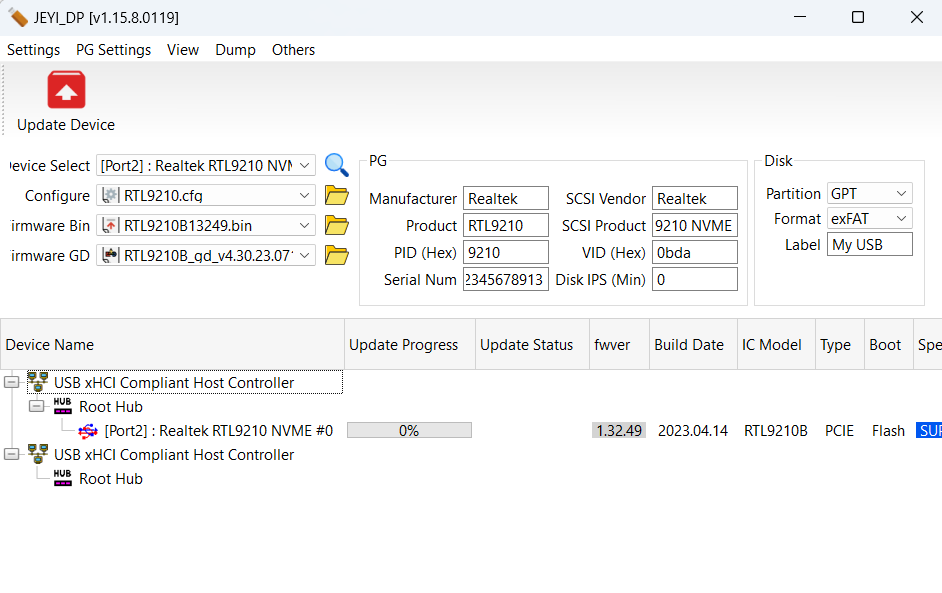

## 起因

Dell G15 5520 游戏本没有第二个硬盘位，本身自带的硬盘只有 500G。随便装点东西就不够用了，此时外接一个固态硬盘就是很好的选择。使用雷电接口接固态硬盘盒，读写速度不是问题，可以直接将软件/游戏装在外接的固态硬盘里使用。

然而使用一段时间（不到一周），发现硬盘通电次数涨到了 500 多。

::: tip 查看方法

一个软件 `CrystalDiskInfo`，在[图吧工具箱](https://www.tbtool.cn/)里也有

:::

这属于不正常现象，很有可能会造成硬盘损坏。

## 解决方法

刷不休眠固件。实际上不用动原本的固件，只需要修改配置文件，然后只刷配置文件就可以了。

需要用到软件 `UTHSB_MPtool_Lite.exe`。在[这里](https://www.station-drivers.com/index.php/en-US/component/remository/Drivers/Realtek/Enclosures-Nvme-USB-3.1-3.2-4.x/NVMe-USB-3.1-USB-3.2/Realtek-RTL9210(B)-NVMe-USB-3.1-Controller-firmware-Version-1.32.49.140423-(Lcd)/lang,en-US/)可以下载固件，自带了此软件。实际上不需要用到里面的固件，只需要里面的刷固件的软件。



1. 连接固态硬盘盒。我是使用的雷电接口连接，据说刷固件时使用普通 USB 接口（Type-A）更好。我硬盘盒中是放着硬盘的，据说放不放都可以。
2. 打开 `UTHSB_MPtool_Lite.exe` 软件，首先 `Dump` -> `Show Device Info`，保存 Dump 的信息。这就是目前固态硬盘盒各项配置的信息。如下所示：
```
**************************************************************
Device : [Port2] : Realtek RTL9210 NVME #0
**************************************************************
U2PHY : n/a
U3PHY : n/a
VID : 0x0bda
PID : 0x9210
MANUFACTURE : "Realtek"
PRODUCT : "RTL9210"
SERIAL : "012345678913"
SCSI_PRODUCT : "RTL9210 NVME    "
SCSI_VENDOR : "Realtek "
USB_SELF_PWR : n/a
DISK_HOTPLUG : n/a
LED : 0x03
PINMUX1 : n/a
PINMUX2 : n/a
U2_MAXPWR : n/a
U3_MAXPWR : n/a
ASPMDIS : n/a
PCIE_REFCLK : n/a
DISK_IPS_THRES : 0x0a
SWR_1_2V : n/a
EN_UPS : n/a
PD : n/a
CUSTOMIZED_LED : 00 00 00 00 00 00 00 00 00 00 00 00 00 00 00 
SUSPEND_LED_OFF : 0x00
FORCE_USB_SPEED : n/a
FORCE_PCIE_SPEED : n/a
EN_U1U2 : n/a
FORCE_USB_QUIRK : n/a
FORCE_PCIE_QUIRK : n/a
FAN : n/a
DIS_SHOW_EMPTY_DISK : n/a
FORCE_SATA_NORMAL_DMA : n/a
UART_DBG_PIN : 0x05
FINGER_PRINT_EN : n/a
RM_INTERNAL_RD : n/a
HS_AUTO_SWITCH : n/a
UART_BAUD_RATE : n/a
CUSTOMIZED_DISK_IDENTIFY : n/a
HW_LED_CFG : 0x00000000
CDROM_CFG : n/a
SUPPORT_HID : n/a
LATE_INIT_DISK : n/a
SCSI_WP_PIN : n/a
SD_MMC_TYPE : n/a
FORCE_PORT_TYPE : n/a
BCDDEVICE : n/a
SUSPEND_DISK_OFF : 0x07
SCSI_WB_PIN : n/a
CUSTOMIZED_FEATURE : n/a
PERIPH_API : n/a
RAID_CFG : n/a

Boot Mode : Flash
FW Ver : 1.32.49
FW Build Date : 2023.04.14
IC Pkg Type : PCIE
UUID : n/a

Disconn_ForceUSB2 : false


```
3. 修改软件自带的配置文件 `RTL9210.cfg`，使其与 Dump 出的配置一致。值为 `n/a` 的忽略。
::: important 关闭休眠功能

`DISK_IPS_THRES` 改为 0

:::
```properties
VID = 0xbda
PID = 0x9210
MANUFACTURE = "Realtek"
SCSI_VENDOR = "Realtek"
PRODUCT = "RTL9210"
SCSI_PRODUCT = "RTL9210 NVME"
SERIAL = "012345678913"
DISK_IPS_THRES = 0
LED = 0x3
HW_LED_CFG = 0x0
CUSTOMIZED_LED = 00 00 00 00 00 00 00 00 00 00 00 00 00 00 00 
SUSPEND_LED_OFF = 0x0
UART_DBG_PIN = 5
SUSPEND_DISK_OFF = 0x7

```
4. `Settings` 菜单，取消 `Firmware Update` 与 `Disk Format` 前面的 √，只选择 `PG`。
5. 确保 `Device Select` 是想要修改的设备，`Configure` 是前面编写的配置文件，然后点 `Update Device` 等执行结束就可以了。
6. 最后可以再次 Dump 一下，看是否修改为了需要的值。

## 总结

修改完成后，使用几个月后通电次数只增加了一点（一百多）。确实有效。

## 参考资料

[固态硬盘盒使用中掉盘、不安全关机现象（RTL9210主控）9/3更新固件 - 哔哩哔哩](https://www.bilibili.com/read/cv16610056/)

[固态硬盘盒 RTL9210主控最新固件 - 哔哩哔哩](https://www.bilibili.com/read/cv17717169/)

[瑞昱RTL9210B固件下载，rtl9210参数翻译及调优建议-CSDN博客](https://blog.csdn.net/m0_55207244/article/details/124491389)

[RTL9210B硬盘盒固件更新 海康MD202和ITGZ硬盘座 - 我不是矿神](https://imnks.com/10081.html)

[RT9210B固件升级 - 哔哩哔哩](https://www.bilibili.com/read/cv31144874/)

[瑞昱RTL9210B芯片的固态硬盘盒升级最新固件v1.30.21版本以及教程 - 哔哩哔哩](https://www.bilibili.com/read/cv19886614/)

[瑞昱RTL9210B芯片的固态硬盘盒升级最新固件v1.32.87--2024年1月22日 - 哔哩哔哩](https://www.bilibili.com/read/cv25796019/)

[RTL9210B固件升级工具下载，RTL9210B硬盘盒固件更新 - 简书](https://www.jianshu.com/p/8c8633bf94ed)

[成功把变砖的RTL9210b硬盘盒救了回来，附量产工具和固件_9210b最新固件-CSDN博客](https://blog.csdn.net/czwhehehe/article/details/125756596)

[【图片】确实孤陋寡闻了，没想到硬盘盒也能刷固件【固态硬盘吧】_百度贴吧](https://tieba.baidu.com/p/8894681520)

[保姆级教程：RTL9210B固件更新与MD202硬盘盒休眠功能关闭及其拆解 - 哔哩哔哩](https://www.bilibili.com/read/cv29332669/)

[Station-Drivers](https://www.station-drivers.com/)

[固态硬盘休眠有什么作用？可以关掉吗？_固态硬盘吧_百度贴吧](https://tieba.baidu.com/p/8564473520)

[瑞昱RTL9210芯片固态硬盘盒最新 v1.29.12.011122固件优化方案_固态硬盘吧_百度贴吧](https://tieba.baidu.com/p/7990027599)
