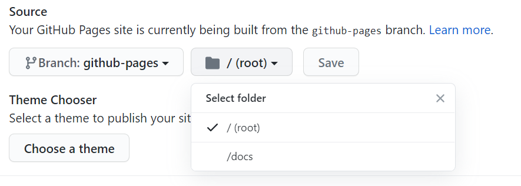

在`github`上部署`github pages`时，有两个选项：部署的内容所在的分支，和分支中的哪个文件夹。然而，分支可以选任意的分支，文件夹却只有两个选项：根目录(`/`)，或`/docs`文件夹。



这就带来了几个问题：
- 很多静态网站生成器（比如`hugo`）默认以`/public`文件夹为网站生成目录，此时就只能在配置中强行更改生成目录为`/docs`
- `/docs`本身语义不明。有些项目将自身的说明文档放在`/docs`，并且有另外的展示`page`，此时就冲突了
- 最重要的一点，此时网站的源代码和生成的内容在同一个分支中，结构较为臃肿，不方便维护

此时就可以用到`git`的`worktree`功能，将源代码和生成的内容放在两个不同的分支中。

## git worktree
官方文档：
> 描述：
> 
> 管理多个**附到同一个仓库的**工作树(working tree)。
> 
> 一个`git`仓库可以支持多个工作树，使你可以同时检出多个分支。`git worktree add`添加一个新的**与此仓库关联的**工作树。与使用`git init`或`git clone`创建的`主工作树`(main working tree)不同，这个新的工作树叫做`关联工作树`(linked working tree)。一个仓库有一个主工作树（如果不是裸的仓库），和零个或多个关联工作树。当你用完了关联工作树后，使用`git worktree remove`移除它。

~~自己翻译的，若有问题。。。不对，我翻译的怎么可能有问题！:sunglasses:~~

个人理解是，`git worktree add`后，在原仓库之外的其他目录创建了一个和原仓库几乎一模一样的仓库，在新的仓库里几乎可以做所有原仓库可以做的事。和重新`clone`一个原仓库不一样的是，在*新的仓库*里所做的改动会自动同步到原仓库中，整个过程都是在本地完成，不涉及到远端。其实仔细观察新的`worktree`的目录也可以发现，在这里`.git`不是目录，而是文件，里面只有一个到原仓库的链接。

`git worktree`的具体语法参见[官方文档](https://git-scm.com/docs/git-worktree)。

## 用来部署 github pages
这个功能是为同时检出多个分支设计的，而我们这里需要源代码和生成的网站同时存在不同的分支中，正好适合。

假设现在网站源代码在`git`仓库的`main`分支中。那么
```bash
git worktree add <到新的工作树的路径>
```
这会在指定位置创建一个工作树，且在`main`分支的当前位置新建一个以`<到新的工作树的路径>的最后一级目录名`命名的分支（若原先没有的话），并在新的工作树中检出它。

这个`<到新的工作树的路径>`可以在原仓库目录外，也可以在原仓库目录内。不过如果在目录内的话需要在仓库的`.gitignore`文件里加上新工作树的目录。在这里，静态网站生成器通常将生成的内容放在同一目录下的文件夹内，就采用在目录内的方式。

现在，只需要
1. 和原来一样在新建的工作树的文件夹内生成网站（例：`hugo`命令）
2. `cd`到此文件夹内
3. `git add .`和`git commit`

这样就可以在两个分支上分别拥有源代码和生成的网站了。之后将两个分支都推送到`github`，设置里选择*拥有生成的网站的分支*进行部署。

## 优点
- 源代码和生成的内容分开
- 生成的网站也拥有提交历史，可以回滚

## 参考
[Using git worktree for deploying to GitHub Pages – musteresel's blog](https://musteresel.github.io/posts/2018/01/git-worktree-for-deploying.html)

[git - Set subdirectory as website root on Github Pages - Stack Overflow](https://stackoverflow.com/questions/36782467/set-subdirectory-as-website-root-on-github-pages)

[Deploy to \`gh-pages\` from a \`dist\` folder on the master branch. Useful for use with \[yeoman\](http://yeoman.io).](https://gist.github.com/cobyism/4730490)

[Git - git-worktree Documentation](https://git-scm.com/docs/git-worktree)